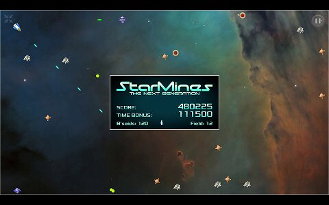

# StarMines: The Next Generation

StarMines is a space shooter inspired by old classics like Asteroids and Omega Race.

The SM:TNG is the [StarMines for Java](http://jpkware.com/smj/StarMines.html) rebooted 
using the HTML5 technology and modern tools like Scala.js.

You can play the game at [smtng.jpkware.com](https://smtng.jpkware.com/).

## Development

- install [SBT 1.3](https://www.scala-sbt.org/download.html)
- run "sbt ~fastOptJS"
- open http://127.0.0.1:12345/classes/index-dev.html in your browser
- whenever you edit the Scala sources, build runs automatically and 
the browser page is refreshed
- IntelliJ Idea recommended as the IDE

The game levels contain enemies spawned based on rules defined in the 
[EnemyManager](src/main/scala/com/jpkware/smtng/EnemyManager.scala) class.
If you'd like to add new enemy types, look at the existing enemy classes derived from the base 
[Enemy](src/main/scala/com/jpkware/smtng/Enemy.scala).

The 'pov' folder contains the Persistence of Vision 3D models used to
render most of the sprites. The pre-rendered sprites were packed 
to sprite sheets with TexturePacker Pro. The 'raw' folder contains
various original resources used to create the other game assets. 
Sprites for new enemy types do not have to be integrated to
the main assets, they can be loaded from new independent images.

The 'server' folder contains a PHP script for high scores. Debugging
it locally requires a local web server with PHP and MySQL to be set up.

The game always posts high scores to jpkware.com, however, the server
accepts the requests only from a set of pre-configured web page URLs which include
 127.0.0.1:12345 and 127.0.0.1:8080 for local dev testing. If you'd like
to host the game on your own site, please contact me and I can add
your site to the whitelist.

The deploy.sh script can be used to deploy the application to a
remote Apache based host (using ~/public_html), assuming SSH keys 
have been set up. The promote.sh is used to promote a deployed 
version to production.

## License

StarMines: The Next Generation copyright [Jari Karjala](https://www.jarikarjala.com/) 
1999-2020. 

StarMines: The Next Generation is licensed under [GNU General Public License v3](LICENSE).

Many tools and resources were used to create the game, 
see [the info screen](src/main/scala/com/jpkware/smtng/StateInfo.scala) 
in the game for all the credits. 
